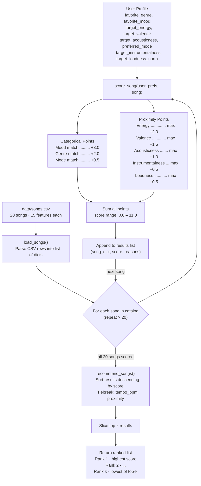

# 🎵 Music Recommender Simulation

## Project Summary

In this project you will build and explain a small music recommender system.

Your goal is to:

- Represent songs and a user "taste profile" as data
- Design a scoring rule that turns that data into recommendations
- Evaluate what your system gets right and wrong
- Reflect on how this mirrors real world AI recommenders

This simulation builds a content-based music recommender that scores songs from a small catalog against a user taste profile. It reads song attributes from `data/songs.csv`, computes a weighted similarity score for each song, and returns the top matches ranked by how closely they match the user's preferred mood, energy level, genre, emotional tone, and acoustic texture.

---

## How The System Works

Real-world recommenders like Spotify and YouTube combine two approaches: collaborative filtering (finding patterns across millions of users' listening behavior — skips, replays, playlist adds) and content-based filtering (matching songs by their audio attributes like tempo, energy, and mood). This simulation focuses on the content-based side. Rather than asking "what do similar users like?", it asks "how closely does each song's measurable qualities match what this user has told us they enjoy?" Each song is scored using a point-based formula — numerical features like energy and valence earn proximity points (closer to the user's target = more points), and categorical features like genre and mood earn fixed points on an exact match. The system awards the most points to **mood** and **energy** as the strongest signals of listening intent, uses **genre** as a taste identity bonus, and refines results with **valence**, **acousticness**, **instrumentalness**, and **loudness**.

### `Song` Features

Each song in `data/songs.csv` stores 15 attributes:

| Feature | Type | Role in scoring |
|---|---|---|
| `id` | Integer | Unique identifier — not scored |
| `title` | String | Display only |
| `artist` | String | Display only |
| `genre` | Categorical | Exact match → **+2.0 pts** |
| `mood` | Categorical | Exact match → **+3.0 pts** |
| `energy` | Float 0–1 | Proximity → **max +2.0 pts** |
| `tempo_bpm` | Float | Tiebreaker only — not scored directly |
| `valence` | Float 0–1 | Proximity → **max +1.5 pts** |
| `danceability` | Float 0–1 | Collected — not scored (correlated with energy) |
| `acousticness` | Float 0–1 | Proximity → **max +1.0 pts** |
| `instrumentalness` | Float 0–1 | Proximity → **max +0.5 pts** |
| `speechiness` | Float 0–1 | Collected — not scored directly |
| `liveness` | Float 0–1 | Collected — not scored directly |
| `loudness_norm` | Float 0–1 | Proximity → **max +0.5 pts** |
| `mode` | Integer 0/1 | Exact match → **+0.5 pts** |

### `UserProfile` Features

The user profile stores the listener's stated preferences:

| Field | Type | Matched against |
|---|---|---|
| `favorite_genre` | String | `song.genre` — binary match |
| `favorite_mood` | String | `song.mood` — binary match |
| `target_energy` | Float 0–1 | `song.energy` — proximity |
| `target_valence` | Float 0–1 | `song.valence` — proximity |
| `target_acousticness` | Float 0–1 | `song.acousticness` — proximity |
| `target_instrumentalness` | Float 0–1 | `song.instrumentalness` — proximity |
| `target_loudness_norm` | Float 0–1 | `song.loudness_norm` — proximity |
| `preferred_mode` | Integer 0/1 | `song.mode` — binary match |

### Algorithm Recipe

Every song is passed through `score_song()` which applies the following rules in order:

**Step 1 — Categorical points (fixed, awarded on exact match):**

```
Mood match   → +3.0 pts   (strongest signal — wrong mood = wrong vibe entirely)
Genre match  → +2.0 pts   (taste identity — but softened so cross-genre is still possible)
Mode match   → +0.5 pts   (minor vs. major alignment — emotional texture tiebreaker)
```

**Step 2 — Proximity points (scaled by closeness to user's target):**

```
For any numerical feature with max points P:
  points = P × (1 − |song_value − target_value|)

  Energy        → max +2.0 pts   (widest spread in catalog: 0.22 – 0.97)
  Valence       → max +1.5 pts   (emotional brightness — refines within a mood)
  Acousticness  → max +1.0 pts   (texture: organic/warm vs. electronic/cold)
  Instrumentalness → max +0.5 pts (vocal vs. instrumental feel)
  Loudness      → max +0.5 pts   (separates rock from metal at similar energy)
```

**Step 3 — Total score:**

```
Maximum possible score = 3.0 + 2.0 + 0.5 + 2.0 + 1.5 + 1.0 + 0.5 + 0.5 = 11.0 pts
```

**Step 4 — Ranking:**

`recommend_songs()` sorts all scored songs descending by total score. Ties are broken by `tempo_bpm` proximity if a `target_bpm` is set in the profile. The top-k results are returned as `(song, score, explanation)` tuples.

### Known Biases and Limitations

- **Genre single-string lock.** A user whose profile says `"lofi"` scores zero genre points on `folk`, `ambient`, and `classical` even when those songs are nearly identical in energy, acousticness, and instrumentalness. A great-fitting song can be buried because its label doesn't match one word.
- **Mood mismatch is a hard cliff.** Mood is worth 3.0 points — the largest single award. A song with the wrong mood label loses 27% of the maximum score instantly, even if every numeric feature is a near-perfect match. A "focused" song will always score below a "chill" song for a chill-seeking user, regardless of how similar they actually sound.
- **Mode is underweighted for emotional nuance.** At only +0.5 pts, whether a song is in a minor or major key barely moves the needle. In practice, mode is one of the strongest predictors of whether a song feels uplifting or melancholic — it likely deserves more influence.
- **Uncollected features are invisible.** `danceability`, `speechiness`, and `liveness` are stored in the CSV but not scored. A hip-hop fan and a jazz fan with identical energy and valence targets will score identically on those dimensions, even though speechiness (high in rap, low in jazz) would strongly separate them.
- **Cold catalog.** With 20 songs, top-k results for niche moods may return weak matches simply because no better option exists. Scores should be interpreted as relative rankings within the catalog, not absolute quality measures.

### Data Flow Diagram



---

## Sample Output

`python src/main.py` runs six profiles — three standard and three adversarial.

---

### Profile 1 — High-Energy Pop

```
============================================================
  PROFILE : High-Energy Pop
============================================================
  Genre        : pop        Mood  : happy
  Energy       : 0.88       Mode  : Major
============================================================
  #1  Sunrise City  --  Neon Echo         Score: 10.69 / 11.00
       Mood match 'happy': +3.0 | Genre match 'pop': +2.0 | Mode match (major): +0.5
       Energy (0.82 vs 0.88): +1.88 | Valence (0.84 vs 0.82): +1.47
       Acousticness (0.18 vs 0.08): +0.90 | Loudness (0.72 vs 0.85): +0.43

  #2  Rooftop Lights  --  Indigo Parade   Score: 8.39 / 11.00
       Mood match 'happy': +3.0 | Genre mismatch ('indie pop' vs 'pop'): +0.0
       Energy (0.76 vs 0.88): +1.76 | Valence (0.81 vs 0.82): +1.49

  #3  Gym Hero  --  Max Pulse             Score: 7.78 / 11.00
       Mood mismatch ('intense' vs 'happy'): +0.0 | Genre match 'pop': +2.0
       Energy (0.93 vs 0.88): +1.90 | Acousticness (0.05 vs 0.08): +0.97
```

---

### Profile 2 — Chill Lofi

```
============================================================
  PROFILE : Chill Lofi
============================================================
  Genre        : lofi       Mood  : chill
  Energy       : 0.38       Mode  : Minor
============================================================
  #1  Midnight Coding  --  LoRoom         Score: 10.75 / 11.00
       Mood match 'chill': +3.0 | Genre match 'lofi': +2.0 | Mode match (minor): +0.5
       Energy (0.42 vs 0.38): +1.92 | Acousticness (0.71 vs 0.8): +0.91

  #2  Library Rain  --  Paper Lanterns    Score: 10.32 / 11.00
       Mood match 'chill': +3.0 | Genre match 'lofi': +2.0
       Energy (0.35 vs 0.38): +1.94 | Acousticness (0.86 vs 0.8): +0.94

  #3  Spacewalk Thoughts  --  Orbit Bloom Score: 7.92 / 11.00
       Mood match 'chill': +3.0 | Genre mismatch ('ambient' vs 'lofi'): +0.0
       Energy (0.28 vs 0.38): +1.80 | Acousticness (0.92 vs 0.8): +0.88
```

---

### Profile 3 — Deep Intense Rock

```
============================================================
  PROFILE : Deep Intense Rock
============================================================
  Genre        : rock       Mood  : intense
  Energy       : 0.91       Mode  : Minor
============================================================
  #1  Storm Runner  --  Voltline          Score: 11.00 / 11.00  ← PERFECT SCORE
       Mood match 'intense': +3.0 | Genre match 'rock': +2.0 | Mode match (minor): +0.5
       Energy (0.91 vs 0.91): +2.00 | Valence (0.48 vs 0.48): +1.50
       Acousticness (0.10 vs 0.10): +1.00 | Loudness (0.85 vs 0.85): +0.50

  #2  Gym Hero  --  Max Pulse             Score: 7.95 / 11.00
       Mood match 'intense': +3.0 | Genre mismatch ('pop' vs 'rock'): +0.0
       Energy (0.93 vs 0.91): +1.96

  #3  Iron Collapse  --  Fracture Line    Score: 5.33 / 11.00
       Mood mismatch ('angry' vs 'intense'): +0.0 | Genre mismatch: +0.0
       Mode match (minor): +0.5 | Energy (0.97 vs 0.91): +1.88
```

---

### Profile 4 — ADVERSARIAL: High Energy + Sad Mood

> **Conflict:** `target_energy=0.92` pulls toward loud intense tracks; `favorite_mood=sad` and `target_valence=0.25` pull toward slow, melancholic ones.

```
============================================================
  PROFILE : ADVERSARIAL - High Energy + Sad Mood
============================================================
  Genre        : blues      Mood  : sad
  Energy       : 0.92       Valence: 0.25   Mode: Minor
============================================================
  #1  Empty Glass Blues  --  Ray Holloway  Score: 9.56 / 11.00
       Mood match 'sad': +3.0 | Genre match 'blues': +2.0 | Mode match (minor): +0.5
       Energy (0.38 vs 0.92): +0.92  ← energy penalised for being too slow
       Valence (0.28 vs 0.25): +1.46 | Acousticness (0.75 vs 0.7): +0.95

  #2  Iron Collapse  --  Fracture Line    Score: 5.05 / 11.00
       Mood mismatch ('angry' vs 'sad'): +0.0 | Genre mismatch: +0.0
       Energy (0.97 vs 0.92): +1.90  ← wins on energy, loses on mood+genre

  #3  Storm Runner  --  Voltline          Score: 4.98 / 11.00
       Mood mismatch ('intense' vs 'sad'): +0.0
       Energy (0.91 vs 0.92): +1.98
```

**Finding:** Mood wins. The sad blues song ranks #1 despite its low energy (0.38 vs target 0.92) because the +3.0 mood match and +2.0 genre match outweigh the energy penalty. The system cannot find a "high-energy sad" song because none exists in the catalog.

---

### Profile 5 — ADVERSARIAL: Genre Not in Catalog (k-pop)

> **Edge case:** No song has `genre = "k-pop"`. Genre match is always +0.0 for every song.

```
============================================================
  PROFILE : ADVERSARIAL - Genre Not in Catalog (k-pop)
============================================================
  Genre        : k-pop      Mood  : happy
  Energy       : 0.80       Mode  : Major
============================================================
  #1  Sunrise City  --  Neon Echo         Score: 8.91 / 11.00
       Mood match 'happy': +3.0 | Genre mismatch ('pop' vs 'k-pop'): +0.0
       Energy (0.82 vs 0.8): +1.96 | Valence (0.84 vs 0.85): +1.48

  #2  Rooftop Lights  --  Indigo Parade   Score: 8.64 / 11.00
       Mood match 'happy': +3.0 | Genre mismatch: +0.0

  #3  Gym Hero  --  Max Pulse             Score: 5.43 / 11.00
       Mood mismatch: +0.0 | Genre mismatch: +0.0
       Mode match (major): +0.5 | Energy (0.93 vs 0.8): +1.74
```

**Finding:** The system degrades gracefully — mood + numeric features still produce a sensible ranking. The gap between #2 (8.64) and #3 (5.43) shows the mood-match cliff still functioning even with zero genre points available.

---

### Profile 6 — ADVERSARIAL: Perfectly Neutral (all 0.5)

> **Edge case:** Every numeric target is 0.5 — the midpoint. Tests whether scores cluster so tightly the ranking becomes meaningless.

```
============================================================
  PROFILE : ADVERSARIAL - Perfectly Neutral (all 0.5)
============================================================
  Genre        : ambient    Mood  : relaxed
  Energy       : 0.5        Mode  : Major
============================================================
  #1  Coffee Shop Stories  --  Slow Stereo  Score: 7.93 / 11.00
       Mood match 'relaxed': +3.0 | Genre mismatch ('jazz' vs 'ambient'): +0.0
       Mode match (major): +0.5 | Energy (0.37 vs 0.5): +1.74

  #2  Spacewalk Thoughts  --  Orbit Bloom   Score: 6.57 / 11.00
       Mood mismatch: +0.0 | Genre match 'ambient': +2.0
       Mode match (major): +0.5 | Energy (0.28 vs 0.5): +1.56

  #3  Velvet Hours  --  Sienna Cole         Score: 5.25 / 11.00
  #4  Gravel Road Home  --  Dusty Creek     Score: 5.17 / 11.00
  #5  Focus Flow  --  LoRoom                Score: 5.16 / 11.00
```

**Finding:** Scores at ranks 3–5 cluster within 0.09 of each other (5.25 / 5.17 / 5.16) — the ranking at that level is nearly arbitrary. The system still produces a clear top-2 (mood match + genre match), but the neutral profile confirms that the more "average" your preferences, the less decisive the recommendations become.

---

## Getting Started

### Setup

1. Create a virtual environment (optional but recommended):

   ```bash
   python -m venv .venv
   source .venv/bin/activate      # Mac or Linux
   .venv\Scripts\activate         # Windows

2. Install dependencies

```bash
pip install -r requirements.txt
```

3. Run the app:

```bash
python -m src.main
```

### Running Tests

Run the starter tests with:

```bash
pytest
```

You can add more tests in `tests/test_recommender.py`.

---

## Experiments You Tried

Use this section to document the experiments you ran. For example:

- What happened when you changed the weight on genre from 2.0 to 0.5
- What happened when you added tempo or valence to the score
- How did your system behave for different types of users

---

## Limitations and Risks

Summarize some limitations of your recommender.

Examples:

- It only works on a tiny catalog
- It does not understand lyrics or language
- It might over favor one genre or mood

You will go deeper on this in your model card.

---

## Reflection

Read and complete `model_card.md`:

[**Model Card**](model_card.md)

Write 1 to 2 paragraphs here about what you learned:

- about how recommenders turn data into predictions
- about where bias or unfairness could show up in systems like this


---

## 7. `model_card_template.md`

Combines reflection and model card framing from the Module 3 guidance. :contentReference[oaicite:2]{index=2}  

```markdown
# 🎧 Model Card - Music Recommender Simulation

## 1. Model Name

Give your recommender a name, for example:

> VibeFinder 1.0

---

## 2. Intended Use

- What is this system trying to do
- Who is it for

Example:

> This model suggests 3 to 5 songs from a small catalog based on a user's preferred genre, mood, and energy level. It is for classroom exploration only, not for real users.

---

## 3. How It Works (Short Explanation)

Describe your scoring logic in plain language.

- What features of each song does it consider
- What information about the user does it use
- How does it turn those into a number

Try to avoid code in this section, treat it like an explanation to a non programmer.

---

## 4. Data

Describe your dataset.

- How many songs are in `data/songs.csv`
- Did you add or remove any songs
- What kinds of genres or moods are represented
- Whose taste does this data mostly reflect

---

## 5. Strengths

Where does your recommender work well

You can think about:
- Situations where the top results "felt right"
- Particular user profiles it served well
- Simplicity or transparency benefits

---

## 6. Limitations and Bias

Where does your recommender struggle

Some prompts:
- Does it ignore some genres or moods
- Does it treat all users as if they have the same taste shape
- Is it biased toward high energy or one genre by default
- How could this be unfair if used in a real product

---

## 7. Evaluation

How did you check your system

Examples:
- You tried multiple user profiles and wrote down whether the results matched your expectations
- You compared your simulation to what a real app like Spotify or YouTube tends to recommend
- You wrote tests for your scoring logic

You do not need a numeric metric, but if you used one, explain what it measures.

---

## 8. Future Work

If you had more time, how would you improve this recommender

Examples:

- Add support for multiple users and "group vibe" recommendations
- Balance diversity of songs instead of always picking the closest match
- Use more features, like tempo ranges or lyric themes

---

## 9. Personal Reflection

A few sentences about what you learned:

- What surprised you about how your system behaved
- How did building this change how you think about real music recommenders
- Where do you think human judgment still matters, even if the model seems "smart"

